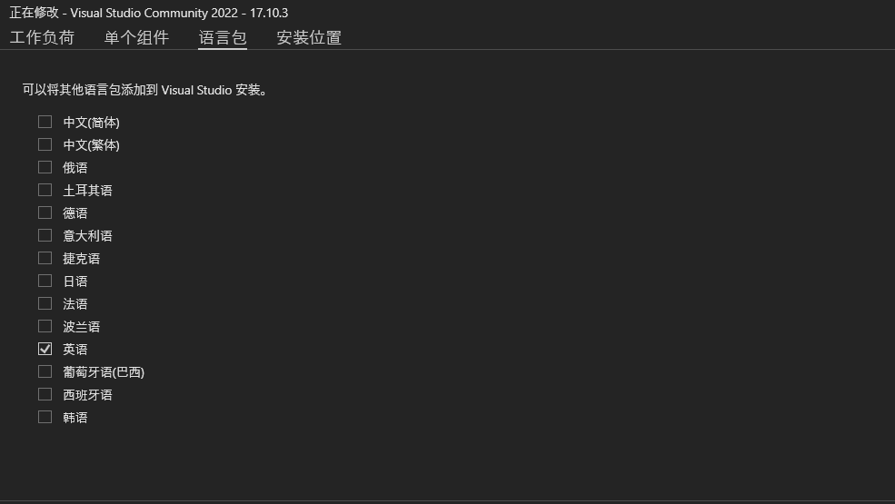

# MPlib: a Lightweight Motion Planning Library for Windows

<p align="center">
  
</p>

[](https://pypi.org/project/mplib/)
[](https://pepy.tech/project/mplib)
[](https://github.com/haosulab/MPlib/releases/tag/nightly)
[](https://motion-planning-lib.readthedocs.io/)
[](https://github.com/haosulab/MPlib?tab=MIT-1-ov-file#readme)

MPlib is a lightweight python package for motion planning,
which is decoupled from ROS and is easy to set up.  
With a few lines of python code, one can achieve most of the motion planning
functionalities in robot manipulation.

## Installation

1. VS2022 with English language package installed.
    <p align="center">
      
    </p>

2. use vcpkg install deps
    ```bash
    git clone https://github.com/microsoft/vcpkg.git
    cd vcpkg
    ./bootstrap-vcpkg.bat
    ./vcpkg.exe install assimp:x64-windows
    ./vcpkg.exe install boost:x64-windows
    ./vcpkg.exe install Eigen3:x64-windows
    ./vcpkg.exe install fcl:x64-windows
    ./vcpkg.exe install ompl:x64-windows
    ./vcpkg.exe install orocos-kdl:x64-windows
    ./vcpkg.exe install urdfdom:x64-windows
    ```
3. clone source code
   ```
   git clone https://github.com/wawatt/MPlib-windows.git
   cd MPlib-windows
   git submodule update --init
   ```
4. change your dir 
   - setup.py line 37
   - dev/mkdoc.sh line 47
   - CMakeLists.txt line 37,38,88
5. build hpp-fcl and pinocchio2 with vcpkg
5. create conda environment and install mplib
    ```bash
    pip install . --log log_install.txt
    ```

## Usage

See our [tutorial](https://motion-planning-lib.readthedocs.io/latest/tutorials/getting_started.html) for detailed usage and examples.
